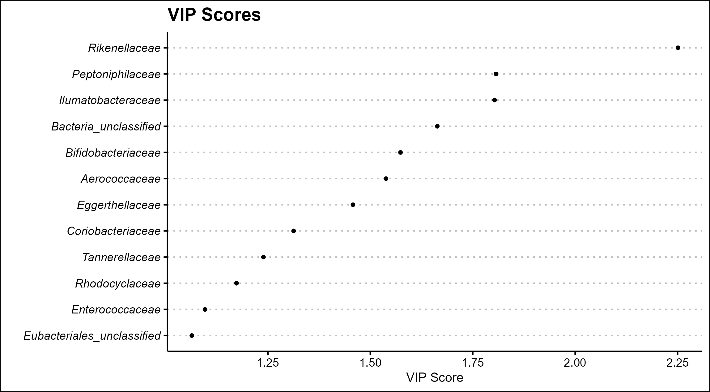

Welcome 👋




### 通过PLS-DA分析探索生物数据中的重要特征

在生物信息学研究中，探索和识别潜在的生物标志物对于理解生物系统至关重要。今天，我们将介绍如何使用 PLS-DA（偏最小二乘判别分析）方法，从生物数据中提取重要特征，并通过 VIP（Variable Importance in Projection）分数进行可视化。

#### 一、项目背景

在微生物组学和生态学研究中，分析样本中的生物多样性及其与环境或处理条件的关系通常是一个挑战。我们可以使用 PLS-DA 方法来有效地提取数据中的信息，尤其是在处理多组数据时。VIP 分数则用于评估每个变量的重要性，以帮助我们从众多特征中识别出关键的生物标志物。

#### 二、所需工具

在本次分析中，我们使用了 R 语言及其多个包，包括：

- **mixOmics**：用于执行 PLS-DA 和计算 VIP 分数。
- **ggplot2** 和 **ggthemes**：用于美观的图形展示。

#### 三、数据准备与读取

首先，我们需要清理工作空间并加载必要的库。接着，我们从指定的目录中读取以 `.txt` 结尾的数据文件，并过滤出包含 `class`、`family`、`genus`、`order`、`phylum` 或 `species` 的文件。

```r
rm(list = ls())
library(mixOmics)
library(ggplot2)
library(ggthemes)

for (i in list.files(path = '../', pattern = '.txt')) {
  if (sapply(c('class', 'family', 'genus', 'order', 'phylum', 'species'), grepl, i) |> any()) {
    data <- read.table(file=paste('../',i,sep = ''), header = TRUE, sep = "\t", fill = TRUE, quote = "")
    ...
  }
}
```

#### 四、数据处理

在代码中，我们筛选出需要保留的列，仅保留表示对照组（Con）和处理组（Mod）的数据。然后，我们进行转置，使得样本为行，特征为列，以方便后续分析。

接下来，我们使用 PLS-DA 方法进行建模，并提取 VIP 分数。这些 VIP 分数表明了各个变量对模型的贡献，帮助我们识别出重要的生物标志物。

```r
abundance_data <- as.data.frame(t(data[,-1]))
...
plsda_result <- plsda(abundance_data, sample_groups, ncomp = 3)
vip_scores <- vip(plsda_result)
```

#### 五、VIP 分数可视化

一旦获得 VIP 分数，我们利用 `ggplot2` 包绘制 VIP 分数图。在图中，我们关注 VIP 值大于等于 1 的特征，并仅选择其中前 25 个重要的变量进行展示。

```r
vip_df <- data.frame(Variable = names(vip_scores_comp1), VIP = vip_scores_comp1)
...
p <- ggplot(vip_df, aes(x = reorder(Variable, VIP), y = VIP)) +
      geom_point(size = 1) +
      coord_flip() +
      ...
```

#### 六、结果输出

最后，我们将绘制的图像保存为 PDF、PNG 和 SVG 格式，以便进一步分享和展示。

```r
ggsave(paste('./',"plsda_vip_scores_", ... ,'.pdf', sep = ''), plot = p, device = "pdf")
```



#### 七、总结

通过以上步骤，我们成功利用 PLS-DA 方法分析了生物数据，并找到了重要的变量。VIP 分数的可视化使得这些变量的相对重要性一目了然，为后续的生物学实验提供了有力的数据支持。

如果您对生物信息学的分析过程感兴趣，欢迎留言讨论！希望这篇文章对您的研究有所帮助，下次见！
